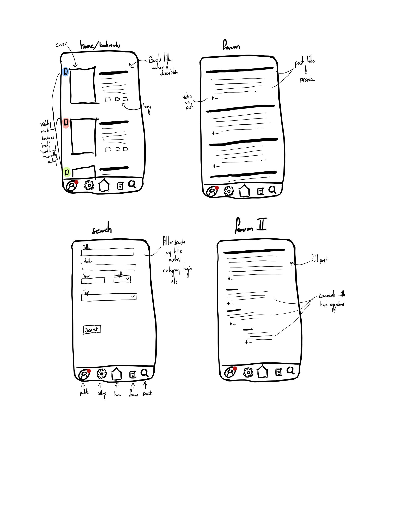
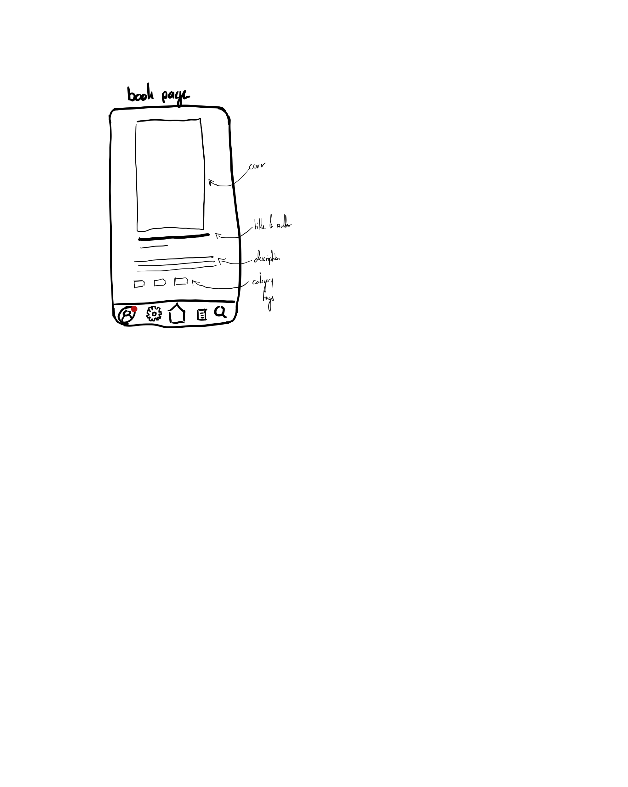

# Akosua Essah Assignment 2: Functional Design #
## Problem Statement ##
**Domain**: I've enjoyed reading as my primary hobby for most of my life. I like novels, especially science fiction, fantasy, and speculative fiction. Ever since I started college, I've beem reading much less, mostly because I've been busy with a multitude of classes and activities, so I'm interested in finding ways to reduce the obstacles to reading books so that I can do it more often.

**Problem**: I know from personal experience that sometimes you're in the mood to read something but don't know how to find a book that fulfills that desire. As someone who has tried many ways to find a good book recommendation, I have some insight into the frustrations of current solutions and a starting idea of what people might be looking for.

**Stakeholders**:
* Authors: If an author's book is recommended more, they'll likely see more sales, which is desirable for them
* Readers: Reader would benefit from finding books they're in the mood for
* Publishers: Like authors, publishers are invested in seeing the success of their books, so they would like their books to be promoted more

**Evidence and Comparables**
- [Lithub: people are better than algorithms](https://lithub.com/for-book-recommendations-people-are-always-better-than-algorithms/): An article that argues that the nuance of what goes into a book recommendation can never be fully captured by an algorithm or software program.
- [r/booksuggestions](https://www.reddit.com/r/booksuggestions/): This is a forum where people ask for suggestions on what to read next. It's entirely dependent on other people, so there's no guarantee that the recommendations given will suit your tastes or that anyone will answer at all.
- [Goodreads](https://www.goodreads.com/): This is the biggest platform for book reviews. Despite having a wide userbase and extensive tag system, it's not seen as a great place for recommendations. It has a limited search feature where you can't search multiple tags/genres at once and an outdated UI that can be a turnoff. It's also easy for a book to get buried if it's not new or extremely popular.
- [Literature Map](https://www.literature-map.com/): This is a graph that connects authors that are similar. It's limited in scale, from what I can tell there are only a couple hundred authors. There's also no way to know what connections are based off of, whether it's genre, themes, writing style, or something else entirely.
- [NYPL Summer 2025 Recs](https://www.nypl.org/books-more/recommendations/staff-picks/adults): This is a list of book recommendations from the staff of the New York Public Library. It's limited in size and in taste, since it's the recommendations of just a few people.
- [Whichbook](https://www.whichbook.net/): This is a site that will suggest books based on location, mood, plot points, and similar books. You can't search based on genre and it won't recommend bestsellers at all.

## Application Pitch ##
**Book Finder**

Having trouble finding your next read? Use **Book Finder** to get quality recommendations

**Key Features**:
- Search by Tags: You can add public tags to books you've read and then you can search for books by one or more tags. If you're in the mood for something super specific, this is your opportunity to search through the library of books and filter by as many tags as you want.
- Recommendations Forum: You can post to the community asking other real members for recommendations. This give readers the oppurtunity to get advice from real people while also allowing users to promote books they think apply, whether it's their own book or just one they love.
- Wishlists: Mark books as want to read, currently reading, dnf (did not finish), and want to read to keep track of your reading journey and get fresh recommendations you haven't seen before

## Conceptual Design ##

**Concept: Tag [User, Item]**

Purpose: label items to assist in searching and organization

Principle: Various users add tags to items. Then, those items can be displayed in groups by shared tag and users can search for items with a specific tag.

State:

    a set of Tags with
      a label String
      an item Item
      a user User
      a private Flag

actions:

    addTag (user: User, label: String, item: Item): (tag: Tag)
      requires: no Tag by user associating item with label
      effects: creates Tag by user associating item with label

    removeTag (tag: Tag)
      effects: deletes tag from Tag set

    markPrivate (tag: Tag)
      requires: tag's private flag is false
      effects: changes tag's private flag to true

    markPublic (tag: Tag)
      requires: tag's private flag is true
      effects: changes tag's private flag to false

 ___

**Concept: Upvote [User, Item]**

Purpose: rank items by popularity

Principle: Various users upvote items. Those items can then be ranked by number of votes.

State:

    a set of Votes with
      a target Item
      a user User

actions:

    upvote (user: User, item: Item):
      requires: no vote by user for item
      effects: adds vote by user for item to Votes set

    unvote (user: User, item: Item)
      requires: a vote by user for item exists
      effects: removes said vote from Votes set

 ___
**Concept: Post [User]**

Purpose: allow users to upload content

Principle: A user creates and publishes a post which can then be seen publically.

State:

    a set of Posts with
      a body String
      an author User

actions:

    create (user: User, body: String):(post:Post)
      effects: creates a post with body by user and adds it to Posts set

    delete (post: Post)
      effects: removes said post from Posts set

    edit (post: Post, newBody: String)
        effects: replaces body of post with newBody

 ___
**Concept: Comment [User, Item]**

Purpose: allow user to upload content related to a specific item

Principle: A user views an item and wants to express an opinion on it. They create and post a comment which is then publically visible and linked to that item

State:

    a set of Comments with
      a body String
      an author User
      a parent Item

actions:

    create (user: User, body: String):(post:Post)
      effects: creates a post with body by user and adds it to Posts set

    delete (post: Post)
      effects: deletes post from Posts set

    edit (post: Post, newBody: String)
        effects: replaces body of post with newBody

 ___

**Concept: Authenticate**

Purpose: authenticate users with passwords

Principle: A user registers with a username and password to create an account. They can then log in with their username and password to access their account

State:

    a set of Users with
      a username String
      a password String

actions:

    register (username: String, password: String):(user:User)
      requires: no User in the Users set has username
      effects: creates a User with username and password and adds it to Users set

    deleteUser (user: User)
      effects: deletes user from Users set

    changePassword (user: User, newPassword: String)
        effects: replaces password of user with newPassword

    authenticate (username: String, password: String):(user:User)
        requires: User with username and password exists in the Users set
        effects: returns that user

 ---
**Concept: Notify[User]**

Purpose: notify users of variuos events

Principle: A user recieves a notification after a certain event which they can then view in whatever inbox the system specifies

State:

    a set of Notifications with
      a user User
      a message String

actions:

    notify (user: User, message: String):(notification:Notification)
      effects: creates a Notification for user with message, adds it to the Notifications set, and returns it to the user

 ---
**Synchronizations**

PrivateStatus:

    When Tag.addTag(user, item: book, label)(tag:Tag)
    Where Tag: label is "read", "currently reading", "dnf", or "want to read"
    Then Tag.markPrivate(tag)

MarkRead:

    When Tag.addTag(user, item: book)
    Then Tag.addTag(user, book, "read")

Delete:

    When Post.delete(post)
    Where Comment: post is the parent of comment
    Then Comment.delete(comment)

NotifyComment:

    When Comment.create(body: comment, parent: post)
    Where Post: author of post is user
    Then Notify.notify(user, "New Comment: " + comment):(notification)

Authentication Syncs:

Post:

    When Request.post(body: String), Authenticate.authenticate(username: String, password: String):user
    Then Post.create(user, body)

Comment:

    When Request.comment(body: String, post: Item), Authenticate.authenticate(username: String, password: String):user
    Then Comment.create(user, body, post)

Upvote:

    When Request.upvote(post: Item), Authenticate.authenticate(username: String, password: String):user
    Then Upvote.upvote(user, post)

Tag:

    When Request.tag(label: String, book: Item), Authenticate.authenticate(username: String, password: String):user
    Then Tag.addTag(user, label, book)

## UI Sketches ##

## User Journey ##
A user is looking for a book to take with them on vacation. They're looking for a western themed whodunit novel, but doesn't know where to look. They open our book recommendation app which opens to a list of books they've marked read. They go to the app's search tab where they fill out the tags field with "western" and "mystery", then click search. The app then takes the user to a page with a list of books that match the entered paramenters. The user scrolls for some time and tags a few books with "want to read". They then navigate to the recommendation forum page where they create a post describing the type of book they want. A few hours later, they recieve a notification that another user replied with a book that seems like exactly what they want. The user checks out the book from the library to take on vacation with them. Afterwards, tags the book as read on the app, along with "western" and "mystery". They're glad they were easily able to find a book they enjoyed.
